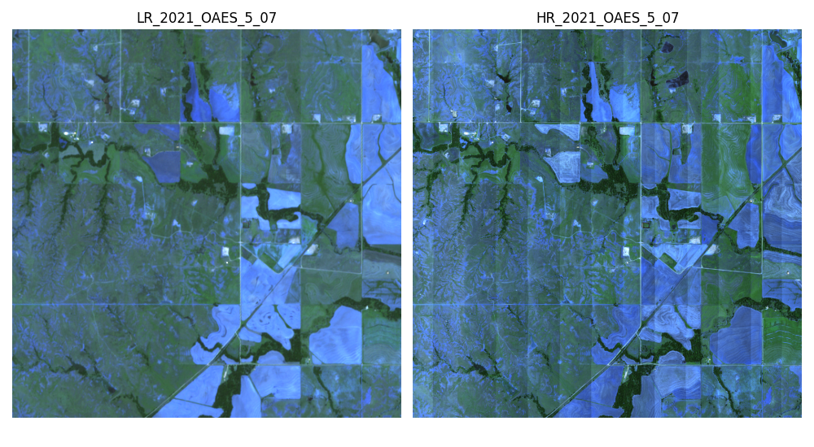
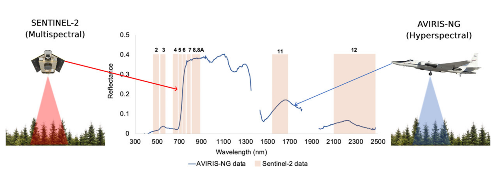

---
license:
  - cc0-1.0
language:
  - en
tags:
  - remote-sensing
  - sentinel-2
  - NEON
  - super-resolution
  - deep-learning
pretty_name: sen2neon
viewer: false
---

<div style="text-align: center; border: 1px solid #ddd; border-radius: 10px; padding: 15px; max-width: 250px; margin: auto; background-color: #f9f9f9;">


  
<b><p>This dataset follows the TACO specification.</p></b>
</div>

<br>


# SEN2NEON: Sentinel-2 & NEON Hyperspectral Super-Resolution Dataset

## Description

### Dataset

A dataset of paired Sentinel-2 multispectral images and NEON hyperspectral imagery for validating super-resolución (SR) algorithms. Each pair consists of a Sentinel-2 image at 10 m resolution and a spatially and temporally aligned NEON image at 2.5 m resolution (resampled from original 1 m). The NEON sensor provides high-resolution “ground truth” reflectance to upscale Sentinel-2 imagery from 10 m to 2.5 m, covering the same spectral bands as Sentinel-2 (except the cirrus band B10). This resource enables development and benchmarking of SR methods to enhance Sentinel-2 imagery using real airborne hyperspectral data.


**Sentinel-2 MSI:** Sentinel-2 is a twin-satellite mission (2A/2B) providing optical imagery with 13 spectral bands spanning visible, near-infrared (VNIR) and shortwave-infrared (SWIR) wavelengths. The Multispectral Instrument (MSI) samples four bands at 10 m, six bands at 20 m, and three bands at 60 m spatial resolution. Sentinel-2’s bands cover 443 nm (coastal aerosol) to 2202 nm (SWIR), supporting applications in vegetation monitoring, water resources, land cover and more. The mission offers global land coverage every `~5` days (with both satellites) and a free, open data policy. In this dataset, Sentinel-2 Level-2A surface reflectance images are used as the **low-resolution (LR)** input.

**NEON Hyperspectral Imagery:** The National Ecological Observatory Network (NEON) collects airborne hyperspectral data via the NEON Imaging Spectrometer (NIS), an instrument based on NASA’s AVIRIS-NG design. The NIS is a **visible-to-SWIR imaging spectrometer** measuring reflected solar radiance from `~380 nm` to 2510 nm in `~5' nm` bands, yielding `~426` contiguous spectral bands. The sensor’s Mercury-Cadmium-Telluride detector array (480×640 px) provides `~1 m` native spatial resolution and is thermally cooled for high signal-to-noise. After calibration and atmospheric correction, NEON releases **surface reflectance image cubes** (Level 2 data product DP3.30006.001) with 1 m pixels and 426 spectral bands. Wavelength regions dominated by atmospheric water vapor (1340–1445 nm and 1790–1955 nm) contain no valid surface data and are flagged (fill value). Notably, this includes Sentinel-2’s cirrus Band 10 (`~1375 nm`) which NEON cannot observe due to atmospheric absorption, explaining its exclusion from this dataset.

### Sensors used

- **Sentinel-2 MSI (Multispectral Instrument):** Optical imager on ESA’s Sentinel-2A/2B satellites in sun-synchronous orbit (`~10:30 am` descending node). 13 bands spanning 443–2190 nm at 10 m, 20 m, 60 m resolutions. Radiometric resolution: 12-bit. The MSI is a pushbroom sensor with three detectors for different resolution groups, which means the 10 m, 20 m, 60 m bands are acquired with slight time offsets. In L2A products, data are atmospherically corrected to surface reflectance (using Sen2Cor). Sentinel-2 data used here are Level-2A with UTM projection, provided by Copernicus Open Access Hub/USGS Earth Explorer. Each image tile covers 100×100 km; our 5.12 km subsets were cropped from these tiles.

- **NEON Airborne Observation Platform (AOP) – Hyperspectral Sensor (NIS, “AVIRIS-NG”):** A high-fidelity imaging spectrometer flown on a light aircraft (e.g., Twin Otter). Collects contiguous spectral bands (`~426 bands`) from 380–2510 nm with `~5 nm` sampling, `~7.5 nm` FWHM, using a diffraction grating and MCT detector array. Typical flight altitude `~1000 m` AGL yields 1 m ground sampling distance; swath `~1 km`. NEON operates three identical NIS units built by NASA JPL . Data is delivered as “Level 1” at-sensor radiance and “Level 2” surface reflectance (after calibración radiométrica, corrección atmosférica y geométrica). Radiometric resolution: 14-bit (digital numbers) converted to physical units. SNR is typically > 100:1 in VNIR and lower in SWIR at full resolution. The NEON data used were downloaded via the NEON Data Portal or via Google Earth Engine. Each NEON flight campaign covers the nominal 1 km × 1 km field site and surrounding area; our 5.12 km subsets may include multiple NEON flight lines mosaicked (NEON provides seamless mosaics per site/year).

By leveraging these two sensors, the dataset combines **satellite multi-spectral imagery** (broad coverage, lower spatial resolution) with **airborne hyperspectral imagery** (local coverage, high spatial and spectral resolution). This fusion enables advanced research in image super-resolution and spectral-spatial data integration.

## Creators

- National Ecological Observatory Network (NEON)  
- Battelle Memorial Institute (operator of NEON)
- Jet Propulsion Laboratory (JPL - NASA) (developer of NEON Imaging Spectrometer)

## Original dataset

- **Version 1.0.0**: [Changelog Link](https://developers.google.com/earth-engine/datasets/catalog/projects_neon-prod-earthengine_assets_HSI_REFL_001?hl=es-419)
  - Initial release of **hyperspectral reflectance mosaics (DP3.30006.001)**.
  - Included 426-band calibrated surface reflectance at **1m resolution**.
  - Available as **HDF5 format** tiles per site (`~1km²` each).
- **Version 2.0.0**: [Changelog Link](https://developers.google.com/earth-engine/datasets/catalog/projects_neon-prod-earthengine_assets_HSI_REFL_002?hl=es-419)
  - **Correction of bidirectional reflectance distribution function (BRDF)** to normalize illumination variations.
  - **Improved topographic correction** for better reflectance consistency.
  - **Extended dataset coverage (2013–2024)** across all NEON sites.
  - **Integration with Google Earth Engine**, enabling cloud-based analysis.

## Taco dataset

**Dataset Construction:** We paired **1234** low-resolution (LR) Sentinel-2 images at **10m** and **20m** resolution with high-resolution (HR) NEON images at **2.5m** resolution (resampled from original 1m) that overlap in location and were captured on near dates (often the **same day** or within a few days) to minimize land cover changes. All sites are within the continental United States, where NEON conducts airborne campaigns and Sentinel-2 has routine coverage. Typical NEON flights occur during peak vegetation season with clear conditions, and only cloud-free Sentinel-2 acquisitions (as indicated by quality flags) were selected. Each paired sample covers a **5.12 × 5.12 km** area (5120m × 5120m) – corresponding to a **512×512 px Sentinel-2 tile (10m/px)** and the same area in a **2048×2048 px NEON image (2.5m/px)**. The NEON hyperspectral data (originally 1m) were resampled to 2.5m resolution by averaging blocks of 2×2m (or via appropriate reprojection) to reduce data volume and align to an exact 4:1 scale difference with Sentinel-2. This ensures each Sentinel-2 pixel aligns with a 4×4 block of NEON pixels, simplifying error calculations for super-resolved outputs.

**Spectral Bands:** The dataset includes **12 spectral bands** matching Sentinel-2’s optical bands **B1–B9 and B11–B12** (Band 10 is omitted as explained). For each Sentinel-2 band, the NEON hyperspectral reflectance was spectrally averaged or integrated to simulate the same bandpass. NEON’s fine spectral resolution allows close emulation of Sentinel-2 band responses, including narrow bands like the red-edge (B5–B7 ~705–783 nm) and water vapor band (B9 ~945 nm). The table below summarizes the included bands:

The table below lists each Sentinel-2 band, its approximate central wavelength, bandwidth, and nominal resolution, as well as its **idx** within the dataset (ranging from 0 to 11 for the 12 retained bands). Note that **Band 10 (Cirrus)** is not included in the SEN2NEON dataset.

| **idx** | **Band** | **Sentinel-2 Name**       | **Central Wavelength** | **Bandwidth** | **Sentinel-2 Resolution**    | **Status in Dataset (simulated from NEON)**                 |
| :-----: | :------- | :------------------------ | :---------------------: | :-----------: | :--------------------------: | :------------------------------------ |
| 0       | B1       | Coastal aerosol           | 443 nm                 | 20 nm         | 60 m (upsampled to 10 m)     | ✔ Included      |
| 1       | B2       | Blue                      | 492 nm                 | 65 nm         | 10 m                         | ✔ Included                             |
| 2       | B3       | Green                     | 560 nm                 | 35 nm         | 10 m                         | ✔ Included                             |
| 3       | B4       | Red                       | 665 nm                 | 30 nm         | 10 m                         | ✔ Included                             |
| 4       | B5       | Red edge 1                | 704 nm                 | 15 nm         | 20 m (upsampled to 10 m)     | ✔ Included      |
| 5       | B6       | Red edge 2                | 740 nm                 | 15 nm         | 20 m (upsampled to 10 m)     | ✔ Included      |
| 6       | B7       | Red edge 3                | 783 nm                 | 20 nm         | 20 m (upsampled to 10 m)     | ✔ Included      |
| 7       | B8       | NIR (Broad)               | 833 nm                 | 106 nm        | 10 m                         | ✔ Included                             |
| 8       | B8A      | NIR (Narrow)              | 865 nm                 | 21 nm         | 20 m (upsampled to 10 m)     | ✔ Included      |
| 9       | B9       | Water vapor (940 nm)      | 945 nm                 | 20 nm         | 60 m (upsampled to 10 m)     | ✔ Included      |
|   –     | B10      | Cirrus (1375 nm)          | 1375 nm                | 30 nm         | 60 m                         | ✘ Excluded (atmospheric absorption)   |
| 10      | B11      | SWIR1                     | 1610 nm                | 90 nm         | 20 m (upsampled to 10 m)     | ✔ Included      |
| 11      | B12      | SWIR2                     | 2200 nm                | 180 nm        | 20 m (upsampled to 10 m)     | ✔ Included      |


> **Table:** Spectral Bands of the Dataset. The central wavelengths and bandwidths correspond to Sentinel-2A. The native 20 m and 60 m bands have been resampled to 10 m to form the Sentinel-2 LR multiband image. “Simulated NEON” indicates that the HR image band was obtained by integrating multiple NEON hyperspectral bands within the equivalent spectral range.

> **Note:** *The "idx" column corresponds to the zero-based band index used in the LR/HR image stacks (for the 12 included bands). Band 10 (Cirrus) is excluded due to the atmospheric absorption region where NEON has no valid data.*


### Compression for GeoTIFF Files:

The dataset uses compression settings to reduce storage size while maintaining data quality:
- **Compression algorithm:** zstd
- **Compression level:** 13
- **Predictor:** 2
- **Interleave mode:** band

### Files Organization (Updated)

Each sample consists of two GeoTIFF files packaged in the **tortilla format**:

- **LR image (Sentinel-2):** A single GeoTIFF containing 12 bands at 10 m resolution (excluding B10). Dimensions: 512 × 512 pixels × 12 bands.

- **HR image (NEON):** A GeoTIFF with 12 bands at 2.5 m resolution for the same area and date. Dimensions: 2048 × 2048 pixels × 12 bands.

The dataset is organized in **[TACO](https://huggingface.co/datasets/tacofoundation/sen2neon)** multi-part files for direct use with the TACO framework. 

## 🔄 Reproducible Example

<a target="_blank" href="https://colab.research.google.com/drive/1o4HFqqFnA4WL5RlHaoKleyODI7-g_-kg?usp=sharing">
  
</a>

Load this dataset using the `tacoreader` library.

```python
import tacoreader
import rasterio as rio
import matplotlib.pyplot as plt

dataset = tacoreader.load("tacofoundation:sen2neon")

# Read a sample row
idx = 273
row = dataset.read(idx)
row_id = dataset.iloc[idx]["tortilla:id"]

# Retrieve the data
lr, hr = row.read(0), row.read(1)
with rio.open(lr) as src_lr, rio.open(hr) as src_hr:
    lr_data = src_lr.read([2, 3, 4]) # Blue, Green, Red of Sentinel-2
    hr_data = src_hr.read([2, 3, 4]) # Blue, Green, Red of Neon

# Display
fig, ax = plt.subplots(1, 2, figsize=(10, 5.5))
ax[0].imshow(lr_data.transpose(1, 2, 0) / 2000)
ax[0].set_title(f'LR_{row_id}')
ax[0].axis('off')
ax[1].imshow(hr_data.transpose(1, 2, 0) / 2000) 
ax[1].set_title(f'HR_{row_id}')
ax[1].axis('off')
plt.tight_layout()
plt.show()
```

<center>
    
</center>


## 🛰️ Sensor Information
The sensor related to the dataset: **sentinel2msi** and **neon-ais**

## 🎯 Task
The task associated with this dataset: **super-resolution**

## 📂 Original Data Repository
Source location of the raw data:**[https://zenodo.org/records/14603764](https://zenodo.org/records/14603764)**
## 💬 Discussion


Insights or clarifications about the dataset: **[https://huggingface.co/datasets/tacofoundation/sen2venus/discussions](https://huggingface.co/datasets/tacofoundation/sen2venus/discussions)**

## 🔀 Split Strategy

All train.

## 📚 Scientific Publications

Publications that reference or describe the dataset.

### Publication 01
- **DOI**: [10.1117/1.3361375](https://doi.org/10.1117/1.3361375)
- **Summary**: 
The National Ecological Observatory Network (NEON) is an ecological observation platform for discovering, understanding and forecasting the impacts of climate change, land use change, and invasive species on continental-scale ecology. NEON will operate for 30 years and gather long-term data on ecological response changes and on feedbacks with the geosphere, hydrosphere, and atmosphere. Local ecological measurements at sites distributed within 20 ecoclimatic domains across the contiguous United States, Alaska, Hawaii, and Puerto Rico will be coordinated with high resolution, regional airborne remote sensing observations. The Airborne Observation Platform (AOP) is an aircraft platform carrying remote sensing instrumentation designed to achieve sub-meter to meter scale ground resolution, bridging scales from organisms and individual stands to satellite-based remote sensing. AOP instrumentation consists of a VIS/SWIR imaging spectrometer, a scanning small-footprint waveform LiDAR for 3-D canopy structure measurements and a high resolution airborne digital camera. AOP data will be openly available to scientists and will provide quantitative information on land use change and changes in ecological structure and chemistry including the presence and effects of invasive species. AOP science objectives, key mission requirements, and development status are presented including an overview of near-term risk-reduction and prototyping activities.
- **BibTeX Citation**:
```bibtex
@article{Kampe2010,
  author    = {Kampe, Thomas U. and Johnson, Brian R. and Kuester, Michele and Keller, Michael},
  title     = {{NEON: the first continental-scale ecological observatory with airborne remote sensing of vegetation canopy biochemistry and structure}},
  journal   = {Journal of Applied Remote Sensing},
  volume    = {4},
  pages     = {043510},
  year      = {2010},
  doi       = {10.1117/1.3361375},
  publisher = {SPIE}
}
```

### Publication 02
- **DOI**: [10.3390/rs12091414](https://doi.org/10.3390/rs12091414)
- **Summary**: Accurately mapping tree species composition and diversity is a critical step towards spatially explicit and species-specific ecological understanding. The National Ecological Observatory Network (NEON) is a valuable source of open ecological data across the United States. Freely available NEON data include in-situ measurements of individual trees, including stem locations, species, and crown diameter, along with the NEON Airborne Observation Platform (AOP) airborne remote sensing imagery, including hyperspectral, multispectral, and light detection and ranging (LiDAR) data products. An important aspect of predicting species using remote sensing data is creating high-quality training sets for optimal classification purposes. Ultimately, manually creating training data is an expensive and time-consuming task that relies on human analyst decisions and may require external data sets or information. We combine in-situ and airborne remote sensing NEON data to evaluate the impact of automated training set preparation and a novel data preprocessing workflow on classifying the four dominant subalpine coniferous tree species at the Niwot Ridge Mountain Research Station forested NEON site in Colorado, USA. We trained pixel-based Random Forest (RF) machine learning models using a series of training data sets along with remote sensing raster data as descriptive features. The highest classification accuracies, 69% and 60% based on internal RF error assessment and an independent validation set, respectively, were obtained using circular tree crown polygons created with half the maximum crown diameter per tree. LiDAR-derived data products were the most important features for species classification, followed by vegetation indices. This work contributes to the open development of well-labeled training data sets for forest composition mapping using openly available NEON data without requiring external data collection, manual delineation steps, or site-specific parameters.
- **BibTeX Citation**:
```bibtex
@article{Scholl2020,
  author    = {Scholl, Victoria M. and Cattau, Megan E. and Joseph, Maxwell B. and Balch, Jennifer K.},
  title     = {Integrating National Ecological Observatory Network (NEON) airborne remote sensing and in-situ data for optimal tree species classification},
  journal   = {Remote Sensing},
  volume    = {12},
  number    = {9},
  pages     = {1414},
  year      = {2020},
  doi       = {10.3390/rs12091414}
}
```

## 🤝 Data Providers

Organizations or individuals responsible for the dataset.
| **Name**                                 | **Role**    | **URL**                                                  |
| :--------------------------------------- | :---------- | :------------------------------------------------------- |
| National Ecological Observatory Network (NEON) | producer   | [https://data.neonscience.org/](https://data.neonscience.org/) |
| European Space Agency (ESA)              | producer    | [https://earth.esa.int/eogateway/missions/sentinel-2](https://earth.esa.int/eogateway/missions/sentinel-2) |
| NASA Jet Propulsion Laboratory (JPL)     | contributor | [https://aviris.jpl.nasa.gov/aviris_ng.html](https://aviris.jpl.nasa.gov/aviris_ng.html) |
| TACO Foundation                          | curator     | [https://github.com/tacofoundations/](https://github.com/tacofoundations/) |

## 🧑‍🔬 Curators

Responsible for structuring the dataset in the TACO format.
|**Name**|**Organization**|**URL**|
| :--- | :--- | :--- |
|Julio Contreras|Image & Signal Processing|[https://juliocontrerash.github.io/](https://juliocontrerash.github.io/)|

## 🌈 Optical Bands


<div style="text-align: center;">
    
    <p><em>Illustration of how Sentinel-2's multispectral bands (in orange-shaded regions) align with the continuous hyperspectral reflectance from NEON's AVIRIS-NG sensor (blue line). The original airborne sensor covers ~380–2500&nbsp;nm in narrow bands, while Sentinel-2 samples broader portions in 13 discrete bands, excluding the heavy water vapor absorption region near 1375&nbsp;nm. Source: https://doi.org/10.3390/rs13091693
	</em></p>
</div>